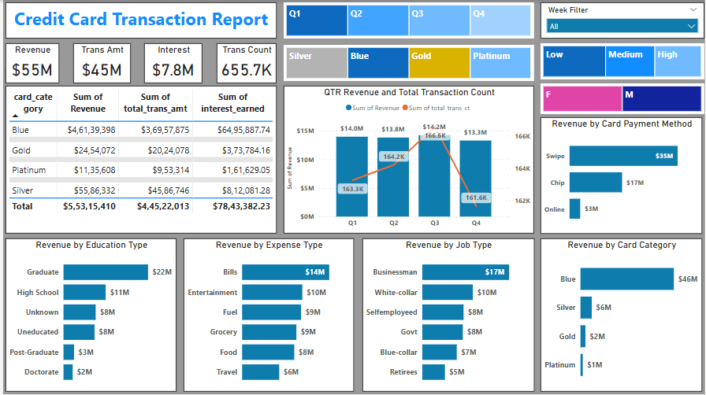
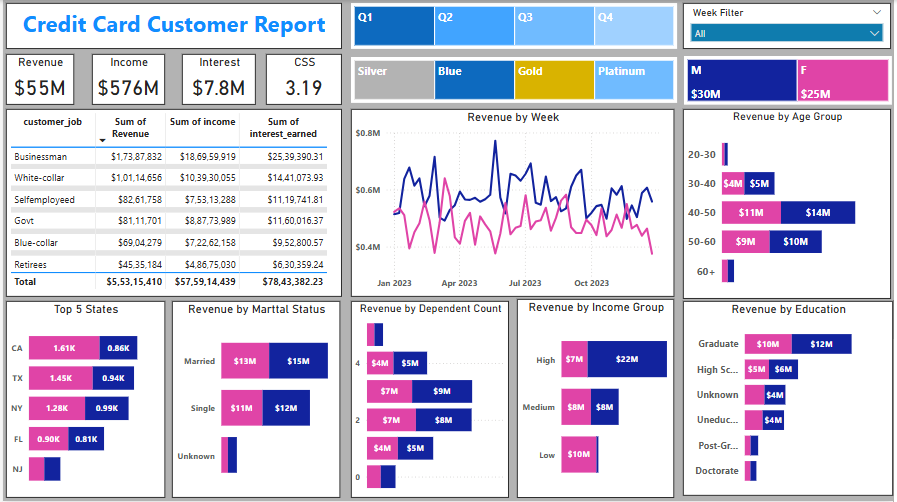

# 💳 Credit Card Financial Dashboard Project (Power BI)

## 📊 Overview
This Power BI dashboard comprehensively analyzes credit card usage, customer demographics, transaction behavior, and revenue performance. Designed to support business decision-making, the dashboard provides clear insights into customer segments, spending patterns, and product performance across various dimensions.

## 🎯 Objective
The objective of this project is to help stakeholders monitor key metrics such as weekly revenue, customer demographics, card usage, and transaction types. The dashboard serves as a powerful tool to optimize product offerings, improve marketing strategies, and increase profitability.

## 🛠️ Tools Used
- **Power BI**: For creating interactive dashboards and visual analytics.
- **PostgreSQL**: Stored, cleaned, and transformed raw datasets.
- **DAX (Data Analysis Expressions)**: Used to create calculated measures and custom KPIs.
- **Excel**: For initial data formatting and inspection.

## 📝 Project Description
The dashboard is built using weekly credit card transaction data and customer demographic data. It showcases various insights including card category performance, revenue trends, income breakdowns, and customer segmentation by age, gender, region, and more.
### 🔍 Dashboard Features

#### 📈 Key Metrics:
- **Total Revenue**: `$55.02M`
- **Total Income**: `$576M`
- **Total Interest Earned**: `$7.8M`
- **Total Transactions**: `655.7K`
- **Customer Satisfaction Score**: `3.19`

#### 📊 Visual Components:
- Revenue trend by week and gender
- Revenue and transaction breakdown by region and state
- Customer distribution by age group, education level, income group, and marital status
- Card category and payment method analysis
- Quarterly transaction volume and revenue analysis
- Geo-map of revenue by state

#### 🎛️ Interactivity:
- Drill-through filters by card category and region
- Slicers for gender, card type, payment method, and more
- Dynamic visuals for weekly and quarterly comparisons

## 🧮 Sample DAX Calculations

```dax
AgeGroup = SWITCH(
    TRUE(),
    'public cust_detail'[customer_age] < 30, "20-30",
    'public cust_detail'[customer_age] >= 30 && 'public cust_detail'[customer_age] < 40, "30-40",
    'public cust_detail'[customer_age] >= 40 && 'public cust_detail'[customer_age] < 50, "40-50",
    'public cust_detail'[customer_age] >= 50 && 'public cust_detail'[customer_age] < 60, "50-60",
    'public cust_detail'[customer_age] >= 60, "60+",
    "unknown"
)

Revenue = 'public cc_detail'[annual_fees] + 'public cc_detail'[total_trans_amt] + 'public cc_detail'[interest_earned]
```

## Dashboard Preview
Here’s a snapshot of the dashboard:



## 🔑 Key Insights

### Revenue Growth:
- Week 53 shows a **28.8% increase in revenue** compared to the previous week.
- Highest revenue comes from **Blue and Silver cards**, contributing over 93% of the total.

### Top Regions & States:
- **Texas**, **New York**, and **California** account for 68% of total revenue.
- The **South region** generates the highest transaction volume.

### Customer Behavior & Segmentation:
- Male customers contribute higher overall revenue than female customers.
- Age group **30–40** and income group **120K–180K** are the most active.
- Activation Rate is **57.5%**, with a Delinquency Rate of **6.06%**.

### Transaction Patterns:
- Swipe and chip payments are the most common methods.
- Most customers are from the **Married** and **College Educated** segments.
- Strong correlation between income level and card category usage.

### Weekly Revenue Fluctuations
- Certain weeks (like Week 50 and Week 53) showed significant spikes in revenue—potentially influenced by seasonal factors (e.g., holidays or year-end shopping).
- These weeks saw higher activation and transaction volumes, suggesting marketing campaigns or seasonal spending influenced engagement.

### Card Category Performance
- Blue Cards lead in total transaction volume but not necessarily in revenue per user.
- Platinum Card users have a higher average transaction value, indicating they could be high-net-worth customers with lower frequency but bigger purchases.

### Payment Method Breakdown
- Chip payments dominate transactions, followed by Swipe and Online methods.
- Online payments have lower usage but higher average transaction value—an opportunity for digital engagement strategies.

### Customer Lifecycle Analysis
- Customers in the 40–50 age group show consistent transaction behavior and higher interest payments, possibly indicating long-term card users with balances carried forward.
- Newer customers (20–30 age group) have higher activation rates but lower transaction value—suggesting early engagement opportunities.

 ### Customer Satisfaction Score (CSS) Trends
- CSS hovers around `3.19`, suggesting moderate satisfaction. A deeper dive could reveal dissatisfaction among specific groups (e.g., high-income customers using lower-tier cards).

## 📢 Recommendations

1. **Target High-Income Segments**
   - Focus marketing efforts on customers earning $120K–$180K, especially those using Blue and Silver cards.

2. **Enhance Customer Engagement**
   - Launch campaigns to increase activation among the inactive 42.5% of customers.

3. **Improve Delinquency Management**
   - Monitor and analyze high-risk profiles to reduce the 6.06% delinquency rate.

4. **Regional Promotions**
   - Offer location-specific promotions in high-performing states like TX, NY, and CA.

5. **Optimize Card Offerings**
   - Promote underutilized card categories with tailored incentives and benefits.
     
6. **Upsell to High Potential Users**
   - Identify Blue Card holders with high spend patterns and cross-sell Platinum or Gold card benefits with loyalty rewards, cashback, or tier upgrades.

7. **Promote Digital Usage**
    -  Incentivize Online Payments to shift more customers toward digital transactions, reducing swipe/card present costs and increasing convenience.

8. **Geo-Targeted Offers**
    - Create state-specific campaigns focused on regions with mid-level revenue but high population (e.g., Florida or Illinois) to unlock untapped potential.

9. **Improve Customer Satisfaction**
    - Survey customers by card category and payment behavior to better understand pain points and adjust service models (e.g., better mobile app experience, rewards tracking, fee transparency).

## 🚀 Project Learning
- Applied data modeling and relationship mapping in Power BI.
- Built custom KPIs using DAX to calculate revenue, interest, activation rate, and delinquency rate.
- Designed an executive-level dashboard layout with slicers, maps, line graphs, and bar charts.
- Gained hands-on experience with customer segmentation and financial metrics.
- Learned to present transactional and behavioral data in a clear, business-friendly format.

## 🏁 Conclusion
The Credit Card Financial Dashboard empowers stakeholders with actionable insights across key performance areas. It helps businesses identify revenue opportunities, optimize card strategies, and better understand customer behavior—ultimately supporting growth and informed decision-making.
