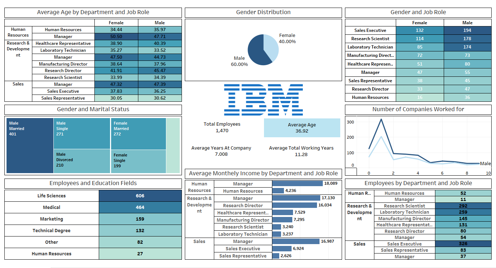

# IBM HR Dashboard Project (Tableau)

## Overview  
This Tableau dashboard analyzes IBM's workforce data, offering deep insights into employee demographics, job roles, compensation, education, and overall workforce distribution. The visualizations aim to empower HR teams to make data-driven decisions that improve hiring, employee engagement, retention, and organizational productivity.

## Objective  
The primary objective of this project is to understand IBM’s workforce structure, income disparities, gender representation, and employment history across departments and roles — providing actionable insights to support HR strategy, workforce planning, and career development initiatives.

## Tools Used  
- **Tableau**: For building interactive dashboards and data visualizations.  
- **Excel**: Used for preliminary data cleaning and exploration.  
- **Git & GitHub**: For version control and project collaboration.

## Project Description  
This project visualizes and explores various aspects of IBM’s HR dataset, including employee age, gender, department, job roles, income, and education fields. The dashboard helps HR professionals identify trends, gaps, and improvement areas to better support the workforce.

### Dashboard Features  
- **Key Metrics**:  
  - Total Employees: 1,470  
  - Average Age: 36.92 years  
  - Average Years at Company: 7.01  
  - Average Total Working Years: 11.28  

- **Visual Components**:  
  - Gender distribution and marital status breakdown  
  - Average age and income by department and job role  
  - Education field representation  
  - Number of companies worked for  
  - Department-wise employee distribution  

- **Interactivity**:  
  - Role-wise and gender-based comparisons  
  - Insightfultreemap and bar charts for comparative analysis  

## Dashboard Preview  
Below is a snapshot of the Tableau dashboard created for this project:

## Tableau Public 
You can also preview this dashboard at the Tableau Public site  -> [IBM HR Dashboard](https://public.tableau.com/app/profile/amitkr209/viz/IBMHRDashboard_17441949492760/IBMHRDashboard)

## Key Insights  
1. **Gender Distribution**:  
   - 60% Male and 40% Female representation across the company.

2. **Department & Job Role Analysis**:  
   - The largest departments are Research & Development and Sales.  
   - Top roles include Research Scientist (292), Sales Executive (326), and Laboratory Technician (259).  

3. **Income Distribution**:  
   - Highest paid roles:  
     - Human Resources Manager: ₹18,089  
     - R&D Manager: ₹17,130  
   - Lowest paid roles:  
     - Sales Representative: ₹2,626  
     - Laboratory Technician: ₹3,237  

4. **Education Fields**:  
   - Most employees come from Life Sciences (606) and Medical (464).  
   - Least representation in Human Resources (27).  

5. **Age Trends**:  
   - The average employee age is 36.92 years.  
   - Sales Representatives and Lab Technicians are among the youngest employees.  
   - Human Resource Managers are among the oldest.  

6. **Experience & Career History**:  
   - Most employees have worked for 1–2 companies previously.  
   - Longest average tenure observed in managerial roles.  

7. **Marital Status**:  
   - The majority are married males (401), followed by single females (272) and single males (271).

## Recommendations  
1. **Address Gender Balance in Specific Roles**:  
   - Encourage female representation in technical and managerial roles.

2. **Optimize Compensation Structure**:  
   - Consider revising salary packages for entry-level and low-income roles like Sales Reps and Lab Technicians.

3. **Leverage Education Backgrounds**:  
   - Develop internal programs to retain and upskill employees from Life Sciences and Medical fields.

4. **Early Tenure Engagement**:  
   - Focus on experience improvement for employees with fewer companies worked to increase retention.

5. **Role-Specific Career Development**:  
   - Provide growth opportunities and mentorship in high-volume and low-income roles to boost morale and performance.

## Project Learning  
1. Developed advanced Tableau visualizations to identify workforce trends.  
2. Improved understanding of employee distribution and compensation across departments.  
3. Analyzed the impact of age, education, and experience on job roles and income.  
4. Learned to present HR data in a clear, interactive, and decision-friendly format.  
5. Gained experience in storytelling through data to support strategic workforce planning.

## Conclusion  
The IBM HR Dashboard created in Tableau enables HR teams and stakeholders to explore, analyze, and improve workforce-related strategies. The insights help enhance hiring processes, compensation management, diversity initiatives, and employee experience, driving long-term organizational growth.
